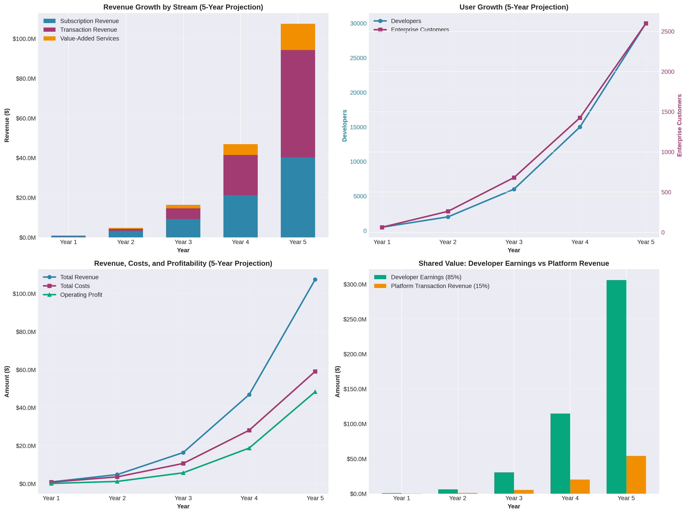

# NightMoves: A Business Model for Collaborative Software Development

## 1. Introduction

NightMoves is a next-generation software development platform designed to foster collaboration between a global community of developers and enterprises seeking high-quality, licensed software. The platform provides a secure, licensed software repository where developers can contribute code, build their reputation, and earn revenue, while enterprises can access a curated library of software assets, reducing development costs and accelerating time-to-market. At its core, NightMoves is built on the principles of **shared value** and **open governance**, creating a sustainable ecosystem that benefits all participants. This document outlines the comprehensive business model for NightMoves, detailing its value proposition, revenue streams, governance structure, and operational framework.

## 2. Value Proposition

The dual-sided nature of the NightMoves platform requires a distinct value proposition for each of its primary actors: Developers and Enterprises. The core value lies in creating a symbiotic relationship where the success of one group directly contributes to the success of the other.

| Actor | Value Proposition |
| :--- | :--- |
| **Developers** | **Monetization and Recognition:** Provides a direct path for developers to monetize their skills and contributions through licensing fees and revenue sharing. The platform also offers a space to build a professional reputation based on the quality and impact of their work. |
| | **Collaborative Environment:** Fosters a collaborative environment for developers to work on projects, learn from peers, and contribute to a growing ecosystem of high-quality software. |
| **Enterprises** | **Access to Licensed Software:** Offers a secure and trusted repository of commercially licensed software components, reducing the legal and security risks associated with traditional open-source software. |
| | **Cost and Time Savings:** Enables enterprises to significantly reduce software development costs and accelerate project timelines by leveraging a vast library of pre-built and vetted software solutions. |

This dual value proposition creates a powerful network effect: as more developers contribute high-quality code, the platform becomes more valuable to enterprises. Increased enterprise adoption, in turn, leads to greater revenue opportunities for developers, attracting more talent to the platform.

## 3. Business Model Canvas

The NightMoves business model can be effectively summarized using the Business Model Canvas framework. This provides a holistic view of the key components that will drive the platform's success.

| Category | Description |
| :--- | :--- |
| **Key Partners** | - **Technology Partners:** Cloud hosting providers (e.g., AWS, Google Cloud, Azure), Git repository providers (e.g., GitLab, GitHub Enterprise). - **Developer Communities:** Open-source communities, developer forums, and educational institutions to attract talent. - **Industry Associations:** Partnerships with software and technology industry groups to promote adoption. |
| **Key Activities** | - **Platform Development & Maintenance:** Continuous improvement of the repository, collaboration tools, and payment systems. - **Community Management:** Fostering a healthy and active community of developers and enterprises. - **Sales & Marketing:** Attracting and onboarding both developers and enterprise customers. - **Governance & Compliance:** Managing the open governance model and ensuring license compliance. |
| **Key Resources** | - **Proprietary Platform:** The NightMoves software repository and collaboration platform. - **Developer Network:** A large and active community of skilled software developers. - **Brand & Reputation:** A trusted brand known for quality, security, and fair governance. |
| **Customer Segments** | - **Developers:** Individual developers, teams, and open-source contributors seeking to monetize their work. - **Enterprises:** Small, medium, and large businesses across various industries seeking to accelerate software development. |
| **Customer Relationships** | - **Self-Service:** Automated onboarding and support for developers and smaller enterprises. - **Dedicated Support:** High-touch support and account management for larger enterprise customers. - **Community Engagement:** Active participation in forums, events, and social media to build relationships. |
| **Channels** | - **Direct Sales:** Enterprise sales team for large accounts. - **Online Marketing:** Content marketing, SEO, and social media to attract developers and SMBs. - **Developer Evangelism:** Engaging with developer communities to drive adoption. |
| **Cost Structure** | - **Platform Hosting & Infrastructure:** Costs associated with cloud services and data storage. - **Research & Development:** Salaries for the engineering team. - **Sales & Marketing:** Costs for marketing campaigns and sales staff. - **General & Administrative:** Operational and administrative expenses. |
| **Revenue Streams** | - **Enterprise Subscriptions:** Tiered subscription plans for enterprises to access and use the software repository. - **Transaction Fees:** A percentage-based fee on all licensing transactions between developers and enterprises. - **Value-Added Services:** Fees for premium services such as dedicated support, training, and custom development. |

## 4. Revenue Model and Shared Value

The financial architecture of NightMoves is designed to be both profitable and equitable, directly reflecting the core principle of shared value. Revenue is generated through a multi-faceted approach that aligns the interests of the platform, developers, and enterprises.

### 4.1. Enterprise Subscription Tiers

Enterprises will subscribe to the NightMoves platform through a tiered pricing model. Each tier will offer a different level of access, support, and features, catering to the diverse needs of small businesses to large corporations.

| Tier | Target Audience | Key Features |
| :--- | :--- | :--- |
| **Basic** | Small businesses & startups | - Access to a limited number of repositories per month. - Standard support. - Basic analytics and reporting. |
| **Professional** | Medium-sized businesses | - Increased access to repositories. - Priority support. - Advanced analytics and compliance tools. |
| **Enterprise** | Large corporations | - Unlimited access to the software repository. - Dedicated account management and 24/7 support. - Advanced security and governance features. - Custom integrations and on-premise deployment options. |

### 4.2. Transaction Fees and Revenue Sharing

A key component of the NightMoves revenue model is a transaction fee applied to all licensing agreements facilitated through the platform. This fee is structured to be competitive and transparent, ensuring that developers receive the majority of the revenue they generate. The proposed revenue sharing model is an 85/15 split, where **85% of the licensing revenue goes to the developer(s)** and **15% is retained by NightMoves** as a platform fee. This is in line with industry standards, such as the Adobe Commerce Marketplace [1].

This revenue sharing model directly implements the shared value concept by creating a direct financial incentive for developers to contribute high-quality, in-demand software. As developers earn more, the platform's revenue also grows, creating a virtuous cycle of growth and value creation.

### 4.3. Value-Added Services

In addition to subscriptions and transaction fees, NightMoves will offer a range of value-added services for an additional fee. These services will provide another revenue stream and cater to the specific needs of enterprise customers. These services include:

- **Professional Services:** Custom development, integration support, and migration services.
- **Training and Certification:** In-depth training programs and certifications for developers and enterprise teams on using the NightMoves platform and best practices for collaborative development.
- **Enhanced Security and Compliance:** Specialized security audits, compliance reporting, and indemnification services.

## 5. Governance and Licensing

### 5.1. Open Governance Framework

NightMoves will operate under a transparent and democratic governance model, inspired by successful open-source projects like the Linux Foundation [2]. The governance structure will be designed to ensure that the platform evolves in a way that benefits the entire community, not just a single entity. The key elements of the governance framework include:

- **NightMoves Foundation:** A non-profit foundation will be established to oversee the governance of the platform. The foundation will be responsible for managing the platform's intellectual property, financial reserves, and the election of the governing board.
- **Governing Board:** The board will be composed of elected representatives from the developer community, enterprise customers, and the NightMoves core team. The board will be responsible for setting the strategic direction of the platform, approving major changes to the platform, and resolving disputes.
- **Technical Steering Committee:** A technical committee, composed of respected developers from the community, will be responsible for the technical roadmap of the platform, including the approval of new features and changes to the core architecture.

### 5.2. Licensing Model

The licensing framework is a critical component of the NightMoves business model. It must provide legal clarity and protection for both developers and enterprises. NightMoves will employ a **dual-licensing model**, a strategy successfully used by companies like MySQL [3].

- **Community License:** Code contributed by developers will be available under a permissive open-source license (e.g., Apache 2.0). This allows for broad adoption and community collaboration.
- **Commercial License:** Enterprises that wish to use the software in proprietary applications or require additional legal protections and warranties will be required to purchase a commercial license. The terms of the commercial license will be standardized to ensure clarity and consistency.

This dual-licensing approach provides a clear path for developers to contribute to the platform while also creating a straightforward mechanism for enterprises to use the software in a commercially supported environment.

## 6. Conclusion

NightMoves presents a compelling business model that addresses a significant need in the software development industry. By creating a collaborative ecosystem built on shared value and open governance, NightMoves is poised to become a leading platform for both developers and enterprises. The combination of a flexible revenue model, a robust governance structure, and a clear licensing framework creates a sustainable and scalable business that will drive innovation and growth in the software industry for years to come.

## References

[1] Adobe. (n.d.). *Revenue share*. Adobe Developer. Retrieved from https://developer.adobe.com/commerce/marketplace/guides/sellers/revenue-share
[2] The Linux Foundation. (2020, October 15). *Introducing the Open Governance Network Model*. The Linux Foundation. Retrieved from https://www.linuxfoundation.org/blog/blog/introducing-the-open-governance-network-model
[3] Wikipedia. (n.d.). *Business models for open-source software*. Wikipedia. Retrieved from https://en.wikipedia.org/wiki/Business_models_for_open-source_software

---

# Appendix A: Financial Projections and Revenue Models

## A.1. Five-Year Financial Projections

The following financial projections are based on conservative growth assumptions informed by industry benchmarks from similar collaborative platforms and software marketplaces. The projections demonstrate the scalability of the NightMoves business model and the substantial shared value created for developers.

### A.1.1. Growth Assumptions

The financial model is built on the following key assumptions:

**Developer Growth:** The platform will experience viral growth as developers recognize the monetization opportunities. Starting with 500 developers in Year 1, the community is projected to grow to 30,000 developers by Year 5, representing a compound annual growth rate (CAGR) of approximately 176%.

**Enterprise Customer Growth:** Enterprise adoption will follow a more conservative trajectory, as sales cycles are longer and require relationship building. The model projects growth from 62 total enterprise customers in Year 1 to 2,600 by Year 5, with a mix across the three subscription tiers.

**Transaction Volume:** As developers become more established on the platform and build larger portfolios, the average number of licensing transactions per developer per year is expected to increase from 2 in Year 1 to 6 in Year 5. The average transaction value is also projected to increase as developers create more sophisticated and valuable software components.

### A.1.2. Revenue Streams Breakdown

The revenue model consists of three primary streams:

1. **Subscription Revenue:** Revenue from enterprise customers subscribing to Basic ($5,000/year), Professional ($25,000/year), and Enterprise ($100,000/year) tiers. This stream grows from $700,000 in Year 1 to $40.25 million in Year 5.

2. **Transaction Revenue:** The platform retains 15% of all licensing transactions between developers and enterprises. This stream grows from $150,000 in Year 1 to $54 million in Year 5, becoming the largest revenue contributor as the platform scales.

3. **Value-Added Services:** Revenue from professional services, training, and enhanced support. This stream grows from $85,000 in Year 1 to $13.2 million in Year 5, representing 10-15% of total revenue.

### A.1.3. Shared Value Creation

A critical aspect of the NightMoves business model is the substantial value created for developers. The financial projections show that **developer earnings significantly exceed platform revenue**, demonstrating the true shared value proposition:

| Year | Developer Earnings | Platform Transaction Revenue | Ratio |
| :--- | :--- | :--- | :--- |
| Year 1 | $850,000 | $150,000 | 5.7:1 |
| Year 2 | $6,120,000 | $1,080,000 | 5.7:1 |
| Year 3 | $30,600,000 | $5,400,000 | 5.7:1 |
| Year 4 | $114,750,000 | $20,250,000 | 5.7:1 |
| Year 5 | $306,000,000 | $54,000,000 | 5.7:1 |

Over the five-year period, developers are projected to earn a cumulative **$458.3 million**, while the platform retains $80.6 million in transaction fees. This 85/15 revenue split ensures that the platform's success is directly tied to developer success, creating a powerful alignment of incentives.

### A.1.4. Profitability and Margins

The cost structure is designed to support rapid growth in the early years while achieving strong profitability as the platform scales. Operating costs as a percentage of revenue are projected to decline from 85% in Year 1 to 55% in Year 5, reflecting economies of scale and operational efficiency improvements.

| Metric | Year 1 | Year 2 | Year 3 | Year 4 | Year 5 |
| :--- | :--- | :--- | :--- | :--- | :--- |
| Total Revenue | $935,000 | $4,806,300 | $16,408,000 | $46,895,000 | $107,445,000 |
| Total Costs | $794,750 | $3,604,725 | $10,665,200 | $28,137,000 | $59,094,750 |
| Operating Profit | $140,250 | $1,201,575 | $5,742,800 | $18,758,000 | $48,350,250 |
| Operating Margin | 15.0% | 25.0% | 35.0% | 40.0% | 45.0% |

The platform is projected to achieve profitability from Year 1, with operating margins expanding significantly as the business scales. By Year 5, the platform is expected to generate $48.4 million in operating profit on $107.4 million in revenue, demonstrating the strong unit economics of the business model.

### A.1.5. Key Financial Metrics

- **Total 5-Year Revenue:** $176.5 million
- **Total 5-Year Developer Earnings:** $458.3 million
- **Year 5 Operating Margin:** 45.0%
- **Developer-to-Enterprise Ratio (Year 5):** 11.5:1

The developer-to-enterprise ratio of 11.5:1 in Year 5 indicates a healthy marketplace with sufficient supply of developer talent to meet enterprise demand, while also ensuring that individual developers have ample opportunities to monetize their contributions.

---

# Appendix B: Operational Framework

To ensure the successful execution of the NightMoves business model, the platform must establish robust operational capabilities across six core business functions: Marketing, Sales, Operations, Development, Finance, and Support. This framework provides a roadmap for building and scaling these critical functions.

## B.1. Marketing

The marketing function is responsible for building awareness of the NightMoves platform, attracting both developers and enterprises, and establishing the brand as a trusted leader in collaborative software development.

### B.1.1. Developer Marketing

Developer marketing will focus on building a vibrant community through content marketing, developer evangelism, and community engagement. Key initiatives include maintaining an active blog featuring technical tutorials and success stories, hosting webinars and workshops on collaborative development best practices, and establishing a presence at major developer conferences and hackathons. The platform will also leverage social media channels, particularly GitHub, Reddit, and Stack Overflow, to engage with the developer community. A developer ambassador program will be created to identify and support influential community members who can advocate for the platform.

### B.1.2. Enterprise Marketing

Enterprise marketing will emphasize the value proposition of cost savings, risk mitigation, and accelerated development. Key tactics include developing comprehensive case studies and ROI calculators that demonstrate the tangible benefits of the platform, producing white papers and research reports on the future of collaborative development, and implementing targeted account-based marketing (ABM) campaigns for high-value enterprise prospects. The marketing team will also establish partnerships with industry analysts and technology media to build credibility and thought leadership.

## B.2. Sales

The sales function is responsible for converting marketing leads into paying customers, with a particular focus on enterprise accounts that represent the largest revenue opportunities.

### B.2.1. Sales Structure

The sales organization will be structured into two primary teams. The **Inside Sales Team** will focus on small and medium-sized businesses, utilizing a high-velocity, consultative sales approach with shorter sales cycles. The **Enterprise Sales Team** will be dedicated to large enterprise accounts, employing a relationship-based approach with longer sales cycles and higher deal values. Each enterprise sales representative will be supported by a sales engineer who can provide technical demonstrations and answer complex technical questions.

### B.2.2. Sales Process

The sales process will be standardized and data-driven, utilizing a CRM system to track all interactions and opportunities. The typical enterprise sales cycle will include initial discovery calls to understand the prospect's needs and challenges, technical demonstrations showcasing the platform's capabilities, proof-of-concept engagements where appropriate, and contract negotiation and closing. Post-sale, accounts will be transitioned to a dedicated customer success team to ensure successful onboarding and ongoing satisfaction.

## B.3. Operations

The operations function encompasses the day-to-day management of the platform, including infrastructure management, security, and community operations.

### B.3.1. Platform Infrastructure

The platform will be built on a modern, cloud-native architecture utilizing leading cloud providers such as AWS, Google Cloud, or Azure. Infrastructure will be designed for high availability, scalability, and security, with automated deployment pipelines and comprehensive monitoring and alerting systems. The operations team will implement disaster recovery and business continuity plans to ensure platform resilience.

### B.3.2. Security and Compliance

Given the sensitive nature of software code and the importance of intellectual property protection, security will be a top priority. The platform will implement industry-standard security practices including encryption at rest and in transit, regular security audits and penetration testing, and compliance with relevant standards such as SOC 2 and ISO 27001. A dedicated security team will monitor for threats and respond to incidents.

### B.3.3. Community Operations

Community operations will focus on fostering a healthy, productive, and inclusive community. This includes moderating forums and discussion channels, enforcing the code of conduct, organizing community events and meetups, and recognizing and rewarding top contributors. The community operations team will work closely with the marketing and product teams to gather feedback and drive engagement.

## B.4. Development

The development function is responsible for building and maintaining the NightMoves platform, including the repository system, collaboration tools, and payment infrastructure.

### B.4.1. Product Development Roadmap

The product roadmap will be driven by a combination of strategic priorities set by the Governing Board, technical requirements identified by the Technical Steering Committee, and user feedback gathered from the community. Key areas of focus will include enhancing the repository management system with advanced search, filtering, and recommendation capabilities, developing sophisticated collaboration tools such as code review, issue tracking, and project management features, building a robust payment and revenue distribution system that automates licensing transactions and developer payouts, and creating comprehensive analytics and reporting dashboards for both developers and enterprises.

### B.4.2. Engineering Culture

The engineering team will embrace an open-source development philosophy, with much of the platform's code being publicly available and open to community contributions. The team will prioritize code quality, maintainability, and documentation, and will utilize modern development practices such as continuous integration and deployment (CI/CD), test-driven development (TDD), and agile methodologies.

## B.5. Finance

The finance function is responsible for managing the platform's financial resources, ensuring accurate accounting and reporting, and supporting strategic decision-making through financial analysis.

### B.5.1. Financial Management

The finance team will implement robust accounting systems to track all revenue streams, including subscriptions, transaction fees, and value-added services. A key responsibility will be managing the revenue sharing system, ensuring that developers are paid accurately and on time. The team will also manage the platform's cash flow, working capital, and investment of reserves.

### B.5.2. Financial Planning and Analysis

The finance team will work closely with leadership to develop annual budgets and multi-year financial plans. Regular financial reporting will provide visibility into key metrics such as revenue growth, customer acquisition costs, lifetime value, and operating margins. Financial analysis will support strategic decisions such as pricing changes, investment in new features, and market expansion.

## B.6. Support

The support function is responsible for ensuring that both developers and enterprises have a positive experience with the platform and can quickly resolve any issues they encounter.

### B.6.1. Developer Support

Developer support will primarily be community-driven, with a comprehensive knowledge base, active forums, and a dedicated Slack or Discord channel where developers can ask questions and help each other. The platform will also provide email support for more complex issues, with a commitment to respond within 24 hours.

### B.6.2. Enterprise Support

Enterprise customers, particularly those on the Professional and Enterprise tiers, will receive dedicated support with guaranteed response times based on their service level agreements (SLAs). This will include access to a dedicated account manager, priority email and phone support, and regular business reviews to ensure the platform is meeting their needs. For Enterprise tier customers, 24/7 support will be available for critical issues.

### B.6.3. Support Infrastructure

The support team will utilize a modern ticketing system to track and manage all support requests. A comprehensive knowledge base will be maintained and continuously updated based on common issues and questions. The support team will work closely with the product and engineering teams to identify and prioritize bug fixes and feature enhancements based on customer feedback.

---

# Appendix C: Governance Structure

The governance structure of NightMoves is designed to ensure transparency, accountability, and community participation in all major decisions affecting the platform. This appendix provides a detailed overview of the governance framework.

## C.1. The NightMoves Foundation

A neutral, non-profit entity, the **NightMoves Foundation**, serves as the legal steward of the platform. The Foundation holds the trademarks, copyrights, and other intellectual property of the NightMoves platform, manages the financial assets of the platform, facilitates the election process for the Governing Board and Technical Steering Committee, and serves as the final arbiter in legal and financial matters. This structure ensures that no single commercial entity can exert undue control over the platform, protecting the interests of the entire community.

## C.2. Governing Board

The **Governing Board** is the primary strategic decision-making body for the NightMoves platform. The board consists of seven members elected to serve two-year terms. The composition includes three Developer Representatives elected directly by the developer community, two Enterprise Representatives elected by enterprise customers with voting power proportional to their subscription tier, one NightMoves Core Team Representative appointed by the core development team, and one Community-at-Large Representative elected by all registered members. This diverse composition ensures that all stakeholder groups have a voice in the platform's strategic direction.

The Governing Board is responsible for setting the overall strategic direction and vision for the platform, approving the annual budget and major financial decisions, overseeing the enforcement of the platform's policies and code of conduct, ratifying changes to the governance charter, and appointing members to special-purpose committees as needed. All board meetings and decisions are documented and made publicly available, ensuring transparency in the governance process.

## C.3. Technical Steering Committee

The **Technical Steering Committee (TSC)** is responsible for the technical oversight and direction of the NightMoves platform. The TSC consists of five members elected by the active developer community, defined as developers who have made contributions in the past 12 months. Candidates for the TSC must have a proven track record of significant technical contributions to the NightMoves ecosystem.

The TSC is responsible for defining and maintaining the technical roadmap for the platform, establishing and enforcing coding standards, contribution guidelines, and review processes, making final decisions on architectural changes and the inclusion of new core features, and resolving technical disputes and providing guidance on best practices. This structure ensures that technical decisions are made by those with the deepest expertise and most active involvement in the platform's development.

## C.4. Decision-Making and Conflict Resolution

Decisions within the governance structure are made with a preference for consensus. When consensus cannot be reached, a simple majority vote is used. All votes are publicly recorded. Major decisions, such as changes to the governance charter or the revenue sharing model, require a two-thirds majority vote of the Governing Board. Disputes within the community are first addressed by the relevant committee, and if a resolution cannot be reached, the issue can be escalated to the Governing Board for a final decision. This multi-tiered approach ensures that conflicts are resolved fairly and efficiently.

---

# Appendix D: Licensing Framework

The licensing framework is a critical component of the NightMoves business model, providing legal clarity and supporting the shared value proposition. This appendix details the dual-licensing model employed by the platform.

## D.1. The Dual-Licensing Model

The dual-licensing model allows NightMoves to offer its software under two different sets of terms and conditions. This approach enables the platform to foster a vibrant open-source community while generating revenue from enterprises that require the additional rights and protections of a commercial license.

## D.2. Community License: Apache License 2.0

All code contributed to the NightMoves platform is licensed under the **Apache License 2.0**, a permissive, OSI-approved open-source license that is widely respected and understood in the software development community. The Apache License 2.0 allows for the free use, modification, and distribution of the software, includes an express grant of patent rights from contributors to users, and provides clarity and standardization that reduces legal ambiguity. Under the Community License, developers can freely contribute to and use the software within the NightMoves ecosystem, fostering a collaborative and innovative environment.

## D.3. Commercial License

Enterprises that wish to use software from the NightMoves repository in their proprietary, closed-source products, or that require additional legal assurances and support, must purchase a **Commercial License**. The Commercial License is a proprietary agreement between the enterprise and NightMoves that provides rights and protections beyond those offered by the Apache License 2.0.

Key features of the Commercial License include the right to incorporate NightMoves software into closed-source, commercial products without the obligation to release the source code, a warranty of originality and non-infringement as well as indemnification against potential intellectual property claims, dedicated technical support and service level agreements (SLAs), and removal of copyleft restrictions that might be present in other open-source licenses. This comprehensive set of protections and rights makes the Commercial License attractive to enterprises that require legal certainty and commercial support.

## D.4. Supporting Shared Value

The dual-licensing model is integral to the shared value proposition of NightMoves. For developers, it provides a clear and direct path to monetization, as they receive a share of the revenue when an enterprise purchases a Commercial License for software they have contributed to. For enterprises, it provides a legally sound and commercially supported way to leverage the innovation of the open-source community while mitigating legal and security risks. For the platform, it creates a sustainable revenue stream that funds ongoing development and community growth. This alignment of interests ensures that all participants benefit from the success of the ecosystem.

## D.5. License Compliance and Enforcement

NightMoves implements a robust system for tracking the usage of software from the repository and ensuring compliance with the licensing terms. This includes automated scanning tools to identify potential compliance issues, clear documentation marking all software with its license, and community education to promote understanding of the licensing terms. By providing a clear, fair, and transparent licensing framework, NightMoves builds a trusted ecosystem where both developers and enterprises can thrive.

---

# Appendix E: Strategic Alignment with Shared Value Principles

The NightMoves business model is fundamentally grounded in the concept of **Creating Shared Value (CSV)**, as articulated by Michael Porter and Mark Kramer [4]. This appendix demonstrates how the platform operationalizes the three core mechanisms of shared value creation.

## E.1. Reconceiving Products and Markets

NightMoves reconceives the traditional software development market by creating a new category that sits between pure open-source and proprietary software. The platform meets the social need of enabling developers worldwide to monetize their skills and contributions, while simultaneously serving the market need of enterprises seeking high-quality, legally compliant software at reduced cost and risk. This reconception creates a win-win scenario where developers gain economic opportunity and enterprises gain access to innovation, fundamentally transforming the economics of software development.

## E.2. Redefining Productivity in the Value Chain

The platform redefines productivity across the software development value chain by enabling collaborative development that improves code quality through peer review and community contribution, reducing enterprise development costs by providing access to pre-built, vetted components, and accelerating time-to-market by eliminating the need to build common functionality from scratch. Additionally, the platform acts as a steward for the intellectual commons, ensuring that valuable software assets are preserved, maintained, and made accessible to future generations of developers. This approach creates economic value while simultaneously advancing the broader software development community.

## E.3. Enabling Local Cluster Development

NightMoves enables cluster development by building a thriving ecosystem of developers, enterprises, educational institutions, and technology partners. The platform provides infrastructure for collaboration through secure repositories, communication tools, and project management capabilities, facilitates knowledge transfer through documentation, tutorials, and community forums, and creates economic opportunities that attract and retain talent in the software development field. By strengthening this cluster, NightMoves creates a positive feedback loop where the success of individual participants reinforces the success of the entire ecosystem, driving sustained innovation and growth.

The alignment of the NightMoves business model with these shared value principles ensures that the platform is not merely extracting value from the market, but actively creating new value that benefits all stakeholders. This approach positions NightMoves for long-term sustainability and impact.

---

# 7. Strategic Recommendations and Next Steps

The successful launch and scaling of NightMoves will require careful execution across multiple dimensions. Based on the comprehensive business model outlined in this document, the following strategic recommendations are proposed for the initial phases of development and market entry.

## 7.1. Phase 1: Foundation Building (Months 1-6)

The first phase should focus on establishing the core infrastructure and governance framework. This includes incorporating the NightMoves Foundation as a non-profit entity, recruiting the initial Governing Board and Technical Steering Committee, developing the minimum viable platform (MVP) with core repository and collaboration features, and establishing the dual-licensing framework and legal documentation. During this phase, it is critical to engage with early adopters from both the developer and enterprise communities to validate the value proposition and gather feedback on the platform design.

## 7.2. Phase 2: Community Building (Months 7-12)

The second phase should focus on building a critical mass of developers and initial enterprise customers. Key initiatives include launching a developer outreach program to attract the first 500 developers, implementing a content marketing strategy to build awareness and establish thought leadership, onboarding the first 50-100 enterprise customers through targeted sales efforts, and establishing community support infrastructure including forums, documentation, and knowledge bases. Success in this phase will be measured by the quality and diversity of contributions to the repository, as well as the level of engagement and satisfaction among early users.

## 7.3. Phase 3: Scaling and Optimization (Year 2-3)

The third phase should focus on scaling the platform to reach thousands of developers and hundreds of enterprise customers. This includes expanding the sales and marketing teams to accelerate customer acquisition, enhancing the platform with advanced features such as AI-powered code recommendations and automated compliance checking, building strategic partnerships with cloud providers, development tool vendors, and educational institutions, and optimizing the revenue model based on data and feedback from the first year of operations. During this phase, the platform should aim to achieve operational profitability and establish itself as a recognized leader in collaborative software development.

## 7.4. Long-Term Vision (Year 4-5 and Beyond)

Looking beyond the initial three years, NightMoves should aspire to become the global standard for collaborative software development and licensing. This long-term vision includes expanding into international markets with localized support and compliance frameworks, developing vertical-specific repositories for industries such as healthcare, finance, and manufacturing, creating an ecosystem of third-party tools and services that integrate with the NightMoves platform, and exploring opportunities for strategic partnerships or acquisitions that can accelerate growth and enhance the value proposition. The ultimate goal is to create a self-sustaining ecosystem where the success of developers and enterprises is inextricably linked, driving continuous innovation and value creation for all participants.

---

# 8. Conclusion

NightMoves represents a transformative opportunity to reshape the economics of software development by creating a collaborative ecosystem built on the principles of shared value and open governance. By connecting developers who seek to monetize their skills with enterprises that need high-quality, legally compliant software, the platform addresses a significant market need while creating substantial economic and social value.

The business model outlined in this document demonstrates the financial viability and scalability of the NightMoves concept. With projected five-year revenue of $176.5 million and developer earnings of $458.3 million, the platform creates a powerful alignment of incentives where the success of one stakeholder group directly contributes to the success of others. The dual-licensing framework provides legal clarity and flexibility, while the open governance structure ensures transparency and community participation in all major decisions.

The operational framework covering Marketing, Sales, Operations, Development, Finance, and Support provides a comprehensive roadmap for building and scaling the platform. By focusing on excellence in each of these core business functions, NightMoves can deliver exceptional value to both developers and enterprises while building a sustainable and profitable business.

As the software industry continues to evolve, platforms like NightMoves that foster collaboration, reward innovation, and create shared value will be increasingly important. By establishing a strong foundation in governance, licensing, and operations, and by maintaining an unwavering commitment to the principles of fairness, transparency, and mutual benefit, NightMoves is positioned to become a leader in the next generation of software development platforms.

The journey from concept to market leader will require dedication, innovation, and a willingness to learn and adapt. However, with a clear vision, a robust business model, and a commitment to shared value, NightMoves has the potential to not only build a successful business but also to make a lasting positive impact on the global software development community.

---

## References

[1] Adobe. (n.d.). *Revenue share*. Adobe Developer. Retrieved from https://developer.adobe.com/commerce/marketplace/guides/sellers/revenue-share

[2] The Linux Foundation. (2020, October 15). *Introducing the Open Governance Network Model*. The Linux Foundation. Retrieved from https://www.linuxfoundation.org/blog/blog/introducing-the-open-governance-network-model

[3] Wikipedia. (n.d.). *Business models for open-source software*. Wikipedia. Retrieved from https://en.wikipedia.org/wiki/Business_models_for_open-source_software

[4] Porter, M. E., & Kramer, M. R. (2011). *Creating Shared Value*. Harvard Business Review. Retrieved from https://hbr.org/2011/01/the-big-idea-creating-shared-value

---

**Document Prepared by:** Manus AI  
**Date:** January 17, 2026  
**Version:** 1.0
